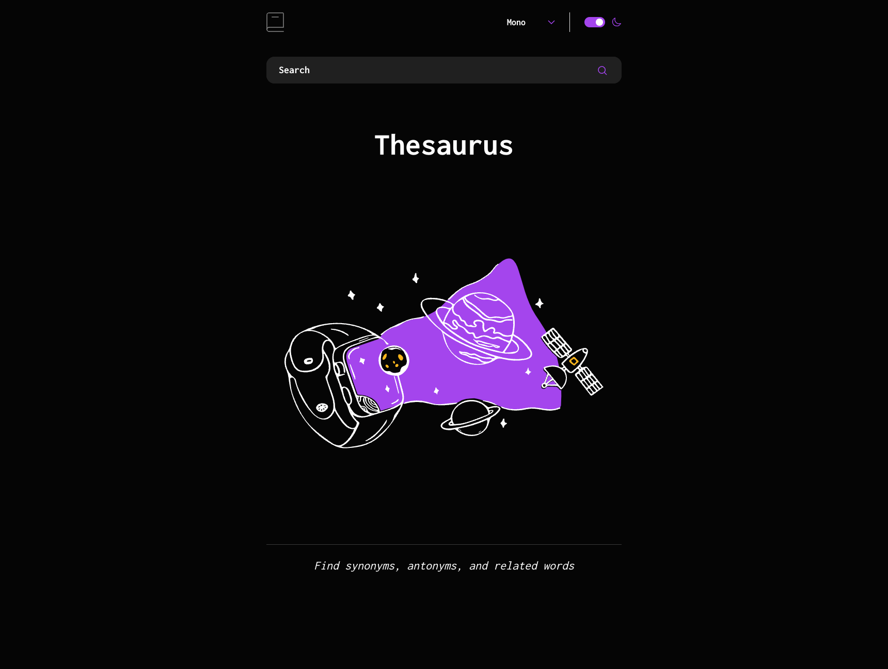
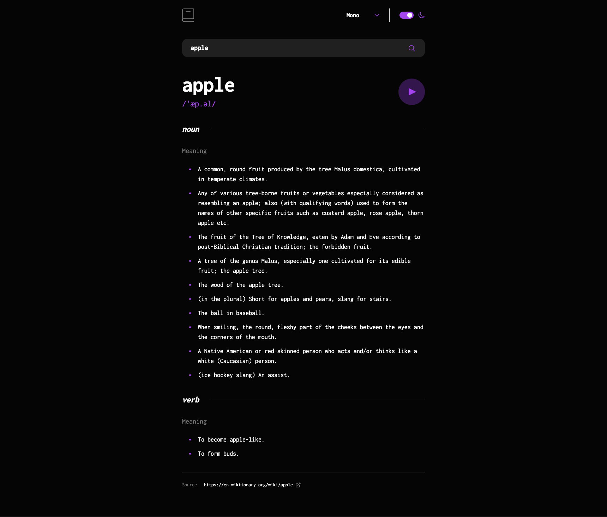
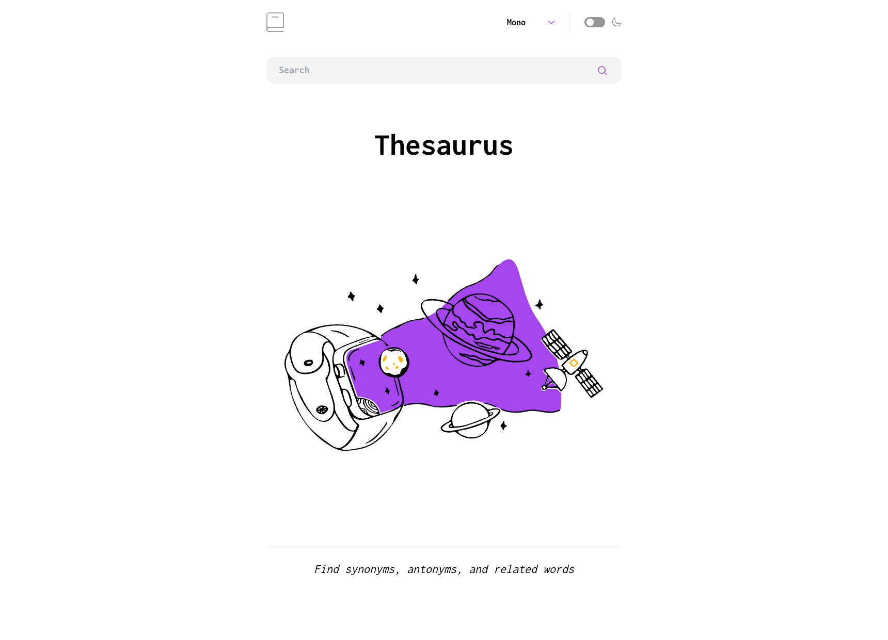
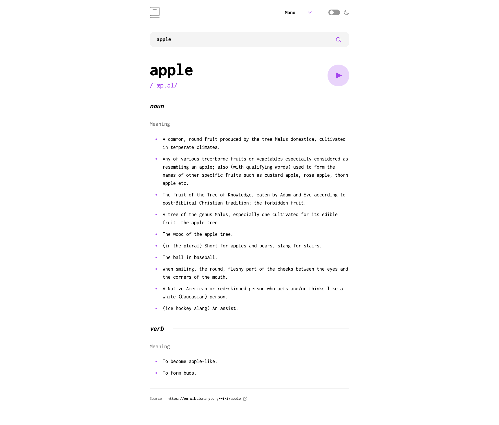

# Frontend Mentor - Dictionary

This is a solution to the [Dictionary web app challenge on Frontend Mentor](https://www.frontendmentor.io/challenges/dictionary-web-app-h5wwnyuKFL).

## Table of contents

-   [Overview](#overview)
    -   [The challenge](#the-challenge)
    -   [Screenshot](#screenshot)
    -   [Links](#links)
-   [My process](#my-process)
    -   [Built with](#built-with)
    -   [What I learned](#what-i-learned)
    -   [Useful resources](#useful-resources)
-   [Author](#author)

## Overview

### The challenge

Users should be able to:

-   Search for words using the input field
-   See the Free Dictionary API's response for the searched word
-   See a form validation message when trying to submit a blank form
-   Play the audio file for a word when it's available
-   Switch between serif, sans serif, and monospace fonts
-   Switch between light and dark themes
-   View the optimal layout for the interface depending on their device's screen size
-   See hover and focus states for all interactive elements on the page

### Screenshot






### Links

-   Live Site URL: [Dictionary](https://dictionary-gules.vercel.app/)

## My process

### Built with

-   [React](https://react.dev/) - JS framework
-   [React Router](https://reactrouter.com/en/main) - Routing
-   [Tailwind](https://www.mongodb.com/) - CSS framework

### What I learned

I had a great time with react. The docs were easy to understand while also providing advanced details when needed. Tailwind worked incredibly good with react, allowing for quick prototyping and testing. React Router is interesting but a bit of time was required in order to get the hang of it.

The bonus challenge stated that I get the correct color scheme from the computer preference. Personally, I believe that a better way to do this is to simply a toggling button that lets the user change the theme whenever they want, without having to change their computer settings. In order to not have the theme reset whenever the page is reloaded, I used local storage to save the color scheme

```js
const [mode, setMode] = useState(localMode);
const [font, setFont] = useState(localFont);

function localMode() {
    const localMode = localStorage.getItem("mode");
    if (localMode === null) {
        return "light";
    }
    return localMode;
}

function localFont() {
    const localFont = localStorage.getItem("font");
    if (localFont === null) {
        return "Sans Serif";
    }
    return localFont;
}
```

I am still unsure if I should have used useEffect hook for retrieving data from localStorage.

```js
useEffect(() => {
    localStorage.setItem("mode", mode);
}, [mode]);
```

When it comes to uploading data to localStorage, I went ahead with useEffect.

Whenever the form is submitted with no value, a custom error should pop up. Initially, I had a hard time figuring how I should do this.

```js
const handleSubmit = (e) => {
    if (value === "") {
        e.preventDefault();
        setError("Whooops, can't be empty!");
    }
};

//....

<Form action={`/${value}`} role="search" className="relative w-full" onSubmit={handleSubmit}>
    <input
        onBlur={() => {
            setError("");
        }}
        type="input"
        aria-label="Search contacts"
        placeholder="Search"
        value={value}
        onChange={(e) => {
            setValue(e.target.value);
            setError("");
        }}
        className={"w-full rounded-2xl bg-[#F4F4F4] py-3 pl-6 pr-14 text-base font-bold focus:outline-none focus:ring-1 focus:ring-[#A445ED] dark:bg-[#1F1F1F] dark:text-white placeholder:dark:text-white md:text-xl placeholder:md:text-xl " + `${error && " focus:ring-[#FF5252]"}`}
    />
    
</Form>;
{
    error && <p className="absolute bottom-[-60%] text-xl text-[#FF5252]">{error}</p>;
}
```

The routing was done using React Router. Very fun to use and the loader was very useful, allowing me to fetch data before any the component was rendered.

```js
const router = createBrowserRouter([
    {
        path: "/",
        element: <App />,
        children: [
            {
                index: true,
                element: <Index />,
            },
            {
                path: "/:wordID",
                element: <Main />,
                loader: wordLoader,
                errorElement: <Error />,
            },
        ],
    },
]);
```

### Useful resources

-   [Hook guide](https://www.youtube.com/watch?v=-bEzt5ISACA&t=6169s) - Helped me understand how different hooks work.

## Author

-   Frontend Mentor - [@GitDoppler](https://www.frontendmentor.io/profile/GitDoppler)
